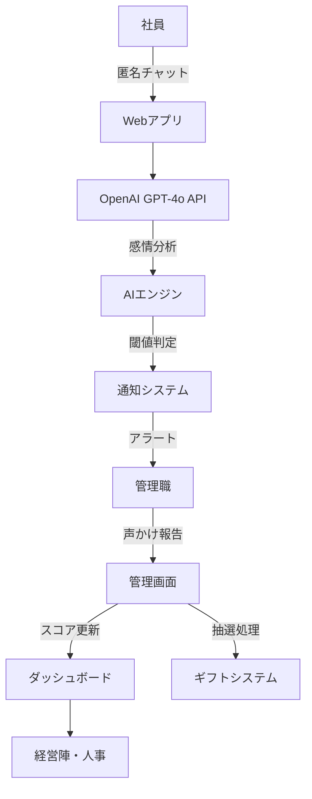

# AI社内カウンセラー
## 悩み共有ラジオ 🎙️

従業員の心理的支援と組織のエンパシー向上を目指すWebアプリケーション

  
    プレゼンテーションを開始 <carbon:arrow-right class="inline"/>
  

  <button @click="$slidev.nav.openInEditor()" title="エディターで開く" class="text-xl slidev-icon-btn opacity-50 !border-none !hover:text-white">
    <carbon:edit />
  </button>
  <a href="https://github.com/slidevjs/slidev" target="_blank" alt="GitHub" title="GitHub で開く" class="text-xl slidev-icon-btn opacity-50 !border-none !hover:text-white">
    <carbon-logo-github />
  </a>

---
transition: fade-out
---

# プロジェクト概要

<v-clicks>

- 🎯 **目的**: 社員の心理的安全性向上と組織のエンパシー文化醸成
- 🤖 **AI活用**: OpenAI GPT-4o APIによる感情解析・対話システム
- 🔒 **プライバシー**: 完全匿名での相談機能
- 📊 **可視化**: 組織全体のエモーショナル気圧マップ
- 🎁 **インセンティブ**: 上司の声かけ行動を促進する報酬システム

</v-clicks>

 
 

<v-click>

社内の「優しさ」を可視化し、心理的支援を自然に促進するプロダクト

</v-click>

---

# 主要機能

## 🗣️ 匿名チャット機能
- 社員はログイン不要で匿名相談
- OpenAI GPTが共感・傾聴対応
- 会話ログは保存されず個人特定不可

## 🧠 AI感情分析＆タグ抽出
- リアルタイム感情解析
- キーワード抽出による状況把握
- 一定閾値超過時の自動レポート作成

## 📢 エンパシー通知システム
- 上司・管理職への匿名アラート
- Slack・LINE・メール連携
- 対応ガイドとヒントの自動生成

## 🎁 インセンティブ設計
- 声かけ報告でギフト券抽選
- エンパシースコアによる評価
- 未対応時のスコア減算システム

---

# システム構成図

<v-click>

**完全匿名性を保持しながら、組織全体のエンパシー向上を実現**

</v-click>

---

# 技術スタック

## フロントエンド
- **Vite + Vanilla JS** - 軽量で高速な開発環境
- **Tailwind CSS + daisyUI** - モダンなUI/UX
- **ES Modules** - モジュラー設計

## バックエンド・API
- **OpenAI GPT-4o API** - 対話・感情分析
- **Firebase/Supabase** - 匿名認証・データ管理
- **Slack/LINE API** - 通知連携

## 開発・デプロイ
- **Node.js** - 開発環境
- **Cloudflare Pages** - 静的サイトホスティング
- **Wrangler CLI** - デプロイ自動化

## 特徴
- ✅ プロトタイプ重視の軽量設計
- ✅ 日本語完全対応
- ✅ レスポンシブデザイン
- ✅ ダーク/ライトモード対応

---

# ユーザージャーニー

## 1. 社員の相談フェーズ
<v-clicks>

- 社員が匿名でWebアプリにアクセス
- AIカウンセラーとのチャット開始
- リアルタイムでの感情分析・キーワード抽出

</v-clicks>

## 2. 自動通知フェーズ
<v-clicks>

- 一定閾値を超えた場合、匿名レポート生成
- 該当部門の管理職へエンパシー通知
- 対応ガイドとヒントの自動提供

</v-clicks>

## 3. 声かけ・フォローフェーズ
<v-clicks>

- 管理職による適切な声かけ実施
- 管理画面での対応報告
- エンパシースコア更新とギフト抽選

</v-clicks>

---

# ダッシュボード機能

## 📊 エモーショナル気圧マップ
- 全社的なストレス状況を可視化
- 部門別の傾向分析
- 時系列での変化追跡

## 📈 KPI指標
- 声かけ率の測定
- 対応速度の分析
- エンパシースコアの推移

## 🎯 管理機能
- 通知の未対応・対応済み管理
- 時間表示による追跡機能
- 部門横断的な状況把握

## 🔐 プライバシー保護
- 完全匿名データ処理
- 即時データ破棄システム
- 暗号化による安全性確保

<v-click>

**人事・経営陣向けの戦略的意思決定支援ツール**

</v-click>

---

# セキュリティ・プライバシー

<v-clicks>

- 🔒 **完全匿名性の保証**: ログイン不要、個人特定情報の一切収集禁止、会話内容の即時破棄
- 🛡️ **データ保護**: 社内IP制限、暗号化通信の徹底、透明性のあるデータ利用ポリシー
- ⚖️ **倫理的配慮**: 社員の心理的安全性を最優先、監視ではなく支援を目的とした設計

</v-clicks>

 

<v-click>

**「見守る」のではなく「支え合う」文化の創造**

</v-click>

---

# 期待される効果

<v-clicks>

## 🌟 社員側のメリット
- 心理的負担の軽減
- 匿名での安全な相談環境
- 適切なタイミングでのサポート受領

## 👥 管理職側のメリット
- 部下の状況を適切に把握
- 具体的な声かけガイダンス
- エンパシースキルの向上

</v-clicks>

<v-clicks>

## 🏢 組織全体のメリット
- エンパシー文化の醸成
- 離職率・休職率の改善
- 生産性とエンゲージメント向上

## 📊 経営側のメリット
- 定量的な組織健康度測定
- 早期問題発見・対応
- 人的資本投資のROI向上

</v-clicks>

---

# 今後の展開

<v-clicks>

## Phase 1: MVP開発
- 基本的なチャット機能の実装
- AI感情分析エンジンの構築
- 通知システムの基盤整備

## Phase 2: 機能拡張
- ダッシュボード機能の充実
- 高度な分析機能の追加
- モバイルアプリ対応

## Phase 3: スケール
- 他社への展開
- 業界特化機能の開発
- AI機能のさらなる高度化

</v-clicks>

 

<v-click>

**組織の「優しさ」を技術で支援し、より良い職場環境の実現を目指す**

</v-click>

---
layout: center
class: text-center
---

# ありがとうございました

[Slidevで作成されたプレゼンテーション](https://sli.dev)

  
    質疑応答 <carbon:arrow-right class="inline"/>
  

